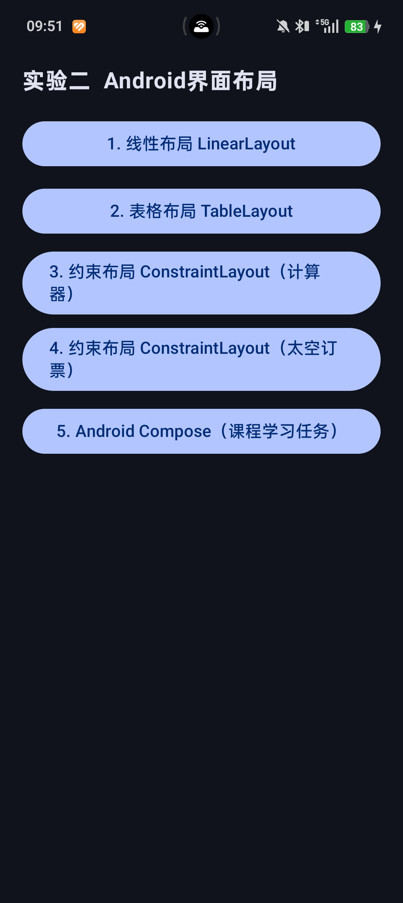
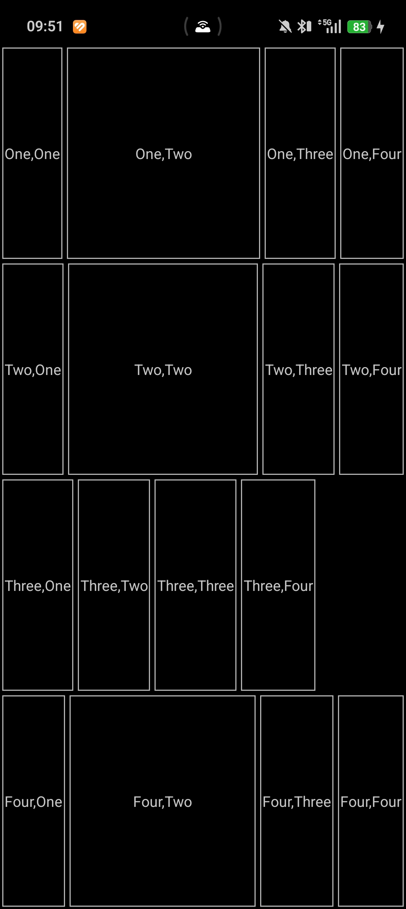
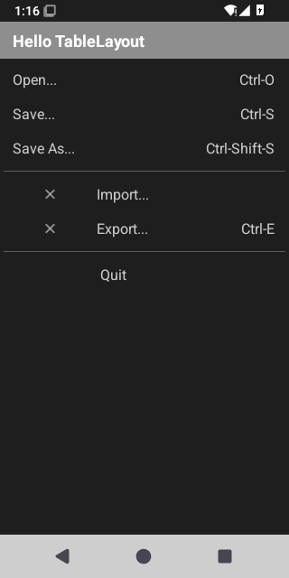
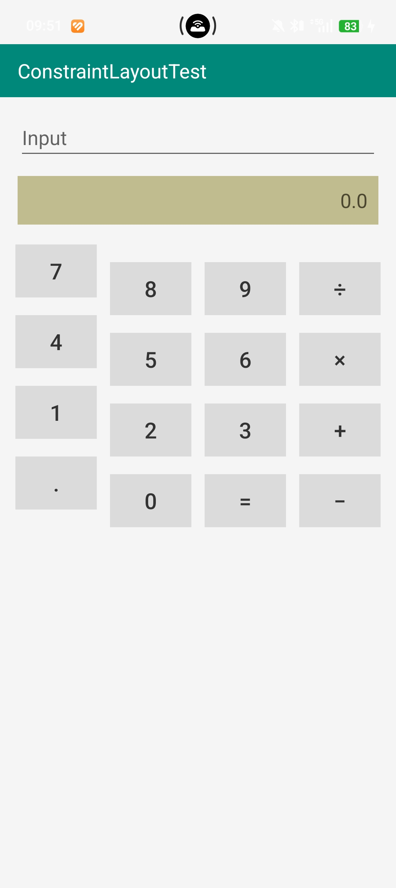
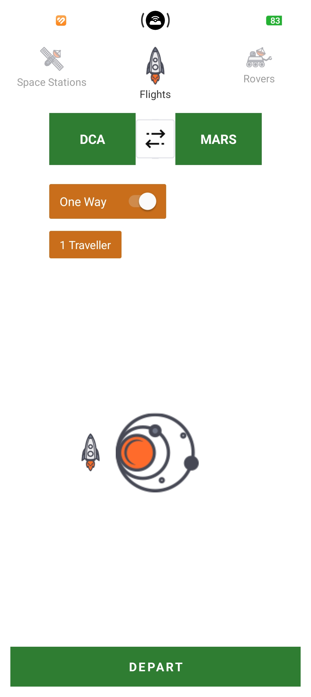
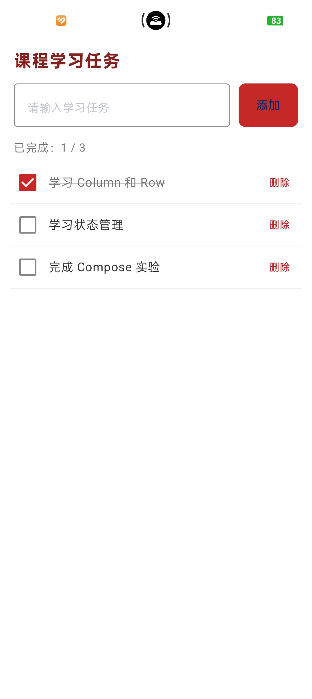

# 实验二 Android 界面布局 实验报告

## 一、实验目的

1. 掌握 Android 常用布局方式：**LinearLayout**（线性布局）、**TableLayout**（表格布局）、**ConstraintLayout**（约束布局）。
2. 理解 `layout_weight`（权重）对剩余空间的分配机制，以及 `stretchColumns` 对表格列的拉伸效果。
3. 熟练运用 ConstraintLayout 的**链（Chain）**、**约束**、**bias** 实现复杂界面的相对定位。
4. 掌握 **Jetpack Compose** 声明式 UI 的基本写法，实现状态驱动的增删改查交互。

## 二、实验环境

| 项目 | 说明 |
|------|------|
| 操作系统 | Windows 11 |
| 开发工具 | Android Studio |
| 编程语言 | Kotlin |
| 构建工具 | Gradle（Kotlin DSL） |
| 最低 SDK | 24（Android 7.0） |
| 目标 SDK | 37 |
| 依赖库 | androidx.constraintlayout:constraintlayout 2.2.1、Jetpack Compose（Material 3） |
| 测试设备 | Android 真机（Android 15，5G） |

## 三、实验内容

应用启动后进入一个 Compose 实现的导航菜单，列出 5 个实验任务入口，点击对应按钮跳转到各布局界面。

<div align="center">



*图1　实验导航主菜单*

</div>

---

### 任务一　LinearLayout —— 4×4 网格

#### 任务描述

使用 LinearLayout 实现一个 4 行 4 列的网格，每个单元格显示行名与列名（如 "One,One"）。第 1、2、4 行的第 2 列通过 `layout_weight="1"` 占据该行剩余宽度；第 3 行不设权重，所有列等宽。

#### 实现要点

- 外层 `LinearLayout` 方向为 `vertical`，内嵌 4 个方向为 `horizontal` 的 `LinearLayout` 作为行。
- 每行使用 `layout_height="0dp"` + `layout_weight="1"` 实现等高分布。
- 单元格统一定义在 `GridCell` 样式中（`wrap_content` 宽度 + 带边框背景）。
- 第 1/2/4 行的第 2 个单元格额外添加 `layout_weight="1"`，使其吸收剩余空间明显变宽。

#### 核心代码

```xml
<!-- 外层纵向 LinearLayout，4 行等高 -->
<LinearLayout
    android:layout_width="match_parent"
    android:layout_height="match_parent"
    android:orientation="vertical"
    android:background="@color/grid_bg">

    <!-- 第 1 行：第 2 列设 layout_weight -->
    <LinearLayout
        android:layout_width="match_parent"
        android:layout_height="0dp"
        android:layout_weight="1"
        android:orientation="horizontal">

        <TextView style="@style/GridCell" android:text="One,One" />

        <TextView
            style="@style/GridCell"
            android:layout_weight="1"
            android:text="One,Two" />          <!-- 权重列：吸收剩余宽度 -->

        <TextView style="@style/GridCell" android:text="One,Three" />
        <TextView style="@style/GridCell" android:text="One,Four" />
    </LinearLayout>

    <!-- 第 3 行：所有列均不设 weight，宽度由内容决定 -->
    <!-- ... -->

</LinearLayout>
```

```xml
<!-- GridCell 样式 -->
<style name="GridCell">
    <item name="android:layout_width">wrap_content</item>
    <item name="android:layout_height">match_parent</item>
    <item name="android:layout_margin">2dp</item>
    <item name="android:background">@drawable/bg_cell</item>
    <item name="android:gravity">center</item>
    <item name="android:textColor">@color/grid_text</item>
    <item name="android:textSize">13sp</item>
</style>
```

#### 运行效果

<div align="center">



*图2　第1/2/4行第2列因 layout_weight 明显变宽，第3行等宽*

</div>

---

### 任务二　TableLayout —— 菜单列表

#### 任务描述

使用 TableLayout 实现一个菜单界面，标题栏显示 "Hello TableLayout"，下方列出 Open、Save、Save As、Import、Export、Quit 六个菜单项，部分项右侧显示快捷键。

#### 实现要点

- `TableLayout` 设置 `stretchColumns="1"`，将第 2 列（空的占位列）拉伸，把快捷键文字推到屏幕右侧。
- 每个菜单项是一个 `TableRow`，含菜单名 + 空占位列 + 快捷键。
- Import / Export 行首列用 `ImageView` 显示图标，不提供第 3 列快捷键（Import）或显示 Ctrl-E（Export）。
- Quit 行第 1 列留空，使 "Quit" 文字与上方菜单项左对齐。
- 菜单项之间用 1dp 分割线分组。

#### 核心代码

```xml
<TableLayout
    android:layout_width="match_parent"
    android:layout_height="wrap_content"
    android:stretchColumns="1">              <!-- 拉伸索引1的空列 -->

    <TableRow>
        <TextView style="@style/MenuItem" android:text="Open..." />
        <TextView style="@style/MenuItem" android:text="" />   <!-- 占位列 -->
        <TextView style="@style/MenuShortcut" android:text="Ctrl-O" />
    </TableRow>

    <!-- ... Save / Save As ... -->

    <TableRow>
        <ImageView android:src="@drawable/ic_remove" />
        <TextView style="@style/MenuItem" android:text="Import..." />
        <!-- Import 无快捷键列 -->
    </TableRow>

    <TableRow>
        <TextView style="@style/MenuItem" android:text="" />   <!-- 留空使Quit对齐 -->
        <TextView style="@style/MenuItem" android:text="Quit" />
    </TableRow>
</TableLayout>
```

#### 运行效果

<div align="center">



*图3　Hello TableLayout 菜单，快捷键右对齐*

</div>

---

### 任务三　ConstraintLayout —— 计算器界面

#### 任务描述

使用 ConstraintLayout 实现一个计算器界面：顶部标题栏 "ConstraintLayoutTest"、输入框、卡其色结果显示条（0.0）、下方 4×4 按钮矩阵（7 8 9 ÷ / 4 5 6 × / 1 2 3 + / . 0 = −）。

#### 实现要点

- 标题栏、输入框、结果条从上到下通过 `top_toBottomOf` 约束垂直排列。
- 每行 4 个按钮组成**横向 spread 链**，按钮宽设为 `0dp`（match_constraint），由链自动等宽分配。
- 按钮统一定义在 `CalcButton` 样式中（`layout_width="0dp"` + 灰色背景 + 48dp 高度）。
- 结果条用卡其色 `bg_calc_result` drawable 作背景，文字右对齐。

#### 核心代码

```xml
<androidx.constraintlayout.widget.ConstraintLayout ...>

    <!-- 标题栏 -->
    <TextView android:id="@+id/tvTitle"
        android:text="ConstraintLayoutTest"
        app:layout_constraintTop_toTopOf="parent" />

    <!-- 输入框 -->
    <EditText android:id="@+id/etInput"
        android:hint="Input"
        app:layout_constraintTop_toBottomOf="@id/tvTitle" />

    <!-- 结果条（卡其色） -->
    <TextView android:id="@+id/tvResult"
        android:text="0.0"
        android:background="@drawable/bg_calc_result"
        android:gravity="center_vertical|end"
        app:layout_constraintTop_toBottomOf="@id/etInput" />

    <!-- 第 1 行按钮：7 8 9 ÷（横向链，0dp 自动等宽） -->
    <Button android:id="@+id/btn7" style="@style/CalcButton" android:text="7"
        app:layout_constraintStart_toStartOf="parent"
        app:layout_constraintEnd_toStartOf="@id/btn8"
        app:layout_constraintTop_toBottomOf="@id/tvResult" />

    <Button android:id="@+id/btn8" style="@style/CalcButton" android:text="8"
        app:layout_constraintStart_toEndOf="@id/btn7"
        app:layout_constraintEnd_toStartOf="@id/btn9"
        app:layout_constraintTop_toTopOf="@id/btn7" />
    <!-- ... btn9, btnDivide ... -->
</androidx.constraintlayout.widget.ConstraintLayout>
```

```xml
<!-- CalcButton 样式：0dp 宽 + 约束链自动等宽 -->
<style name="CalcButton">
    <item name="android:layout_width">0dp</item>
    <item name="android:layout_height">48dp</item>
    <item name="android:layout_marginStart">6dp</item>
    <item name="android:layout_marginEnd">6dp</item>
    <item name="android:background">@drawable/bg_calc_button</item>
    <item name="android:textSize">20sp</item>
</style>
```

#### 运行效果

<div align="center">



*图4　ConstraintLayoutTest 计算器，4×4 按钮等宽排列*

</div>

---

### 任务四　ConstraintLayout —— 太空订票界面

#### 任务描述

使用 ConstraintLayout 实现一个太空旅行订票界面：顶部三个选项卡（Space Stations / Flights / Rovers）、绿色 DCA 和 MARS 目的地框 + 中间双向箭头切换按钮、One Way 开关、1 Traveller 人数、中部火箭与星系图片、底部绿色 DEPART 按钮。

#### 实现要点

- **选项卡**：三个 `LinearLayout`（图标+文字）组成横向 `spread` 链，当前选中 Flights 图标全色显示，其余 `alpha=0.45` 灰显。
- **DCA ↔ MARS**：tvDca、ivArrows、tvMars 组成 `packed` 链居中。ivArrows 设白底背景，放在 XML 末尾确保绘制在两个绿框之上，覆盖交界处。
- **One Way 开关**：橙色圆角背景的 LinearLayout 内嵌文字 + Switch，`thumbTint` 白色、`trackTint` 浅灰。
- **火箭 + 星系**：ivRocket 和 ivGalaxy 组成 `packed` 链，通过 `horizontal_bias="0.42"` 微调水平位置。
- **DEPART 按钮**：约束在父容器底部，全宽绿色背景。

#### 核心代码

```xml
<!-- DCA、箭头、MARS 三元素 packed 链 -->
<TextView android:id="@+id/tvDca"
    android:layout_width="100dp"
    android:layout_height="60dp"
    android:background="@drawable/bg_green"
    android:text="DCA"
    app:layout_constraintHorizontal_chainStyle="packed"
    app:layout_constraintStart_toStartOf="parent"
    app:layout_constraintEnd_toStartOf="@id/ivArrows"
    app:layout_constraintTop_toBottomOf="@id/tabStations" />

<TextView android:id="@+id/tvMars"
    android:layout_width="100dp"
    android:layout_height="60dp"
    android:background="@drawable/bg_green"
    android:text="MARS"
    app:layout_constraintStart_toEndOf="@id/ivArrows"
    app:layout_constraintEnd_toEndOf="parent"
    app:layout_constraintTop_toTopOf="@id/tvDca" />

<!-- 双向箭头：白底，放最后绘制，覆盖两框交界 -->
<ImageView android:id="@+id/ivArrows"
    android:layout_width="46dp"
    android:layout_height="46dp"
    android:background="@color/white"
    android:src="@drawable/double_arrows"
    app:layout_constraintStart_toEndOf="@id/tvDca"
    app:layout_constraintEnd_toStartOf="@id/tvMars"
    app:layout_constraintTop_toTopOf="@id/tvDca"
    app:layout_constraintBottom_toBottomOf="@id/tvDca" />
```

#### 运行效果

<div align="center">



*图5　太空订票：选项卡、DCA↔MARS、One Way、DEPART*

</div>

---

### 任务五　Jetpack Compose —— 课程学习任务清单

#### 任务描述

使用 Jetpack Compose 实现一个课程学习任务清单：深红色标题、输入框 + 红色"添加"按钮、"已完成：x/y" 计数、可勾选复选框（勾选后文字加删除线）、红色"删除"按钮。初始 3 项任务完成 1 项，支持添加新任务。

#### 实现要点

- 使用 `SnapshotStateList<Task>` 管理任务列表，增删改自动触发重组。
- `Checkbox` 自定义颜色（勾选红色、未勾选灰色），勾选状态通过 `task.copy(done = checked)` 更新。
- 文字 `TextDecoration.LineThrough` 与勾选状态联动，勾选后显示删除线并变灰。
- `doneCount` 由 `tasks.count { it.done }` 实时计算，计数自动更新。
- `LazyColumn` + `items(key = { it.id })` 渲染列表，每项含复选框、任务名、删除按钮。

#### 核心代码

```kotlin
private data class Task(val id: Int, val name: String, val done: Boolean)

@Composable
private fun TaskListScreen() {
    // 初始 3 项任务，完成 1 项
    val tasks: SnapshotStateList<Task> = remember {
        listOf(
            Task(1, "学习 Column 和 Row", true),
            Task(2, "学习状态管理", false),
            Task(3, "完成 Compose 实验", false)
        ).toMutableStateList()
    }
    var input by remember { mutableStateOf("") }
    val doneCount = tasks.count { it.done }

    Column {
        Text("课程学习任务", color = TitleRed, fontWeight = FontWeight.Bold)

        // 输入框 + 添加按钮
        Row {
            OutlinedTextField(
                value = input,
                onValueChange = { input = it },
                placeholder = { Text("请输入学习任务") }
            )
            Button(
                onClick = {
                    if (input.trim().isNotEmpty()) {
                        tasks.add(Task(nextId++, input.trim(), false))
                        input = ""
                    }
                },
                colors = ButtonDefaults.buttonColors(containerColor = Red)
            ) { Text("添加") }
        }

        Text("已完成：$doneCount / ${tasks.size}")

        // 任务列表
        LazyColumn {
            items(tasks, key = { it.id }) { task ->
                Row {
                    Checkbox(
                        checked = task.done,
                        onCheckedChange = { tasks[tasks.indexOfFirst { it.id == task.id }] =
                            task.copy(done = it) },
                        colors = CheckboxDefaults.colors(checkedColor = Red)
                    )
                    Text(
                        text = task.name,
                        textDecoration = if (task.done) TextDecoration.LineThrough else null,
                        color = if (task.done) GrayText else Color(0xFF333333)
                    )
                    TextButton(onClick = { tasks.removeAll { it.id == task.id } }) {
                        Text("删除", color = Red)
                    }
                }
            }
        }
    }
}
```

#### 运行效果

<div align="center">



*图6　课程学习任务清单，已完成 1/3，勾选项有删除线*

</div>

## 四、实验总结

本次实验通过 5 个子任务系统练习了 Android 的四种主要布局方式：

1. **LinearLayout**：通过 `layout_weight` 实现剩余空间的按比例分配。实验中第 1/2/4 行第 2 列设权重后明显变宽，第 3 行无权重保持等宽，直观对比了权重对布局的影响。

2. **TableLayout**：通过 `stretchColumns` 拉伸指定列，配合空占位列实现了菜单名与快捷键的左右对齐效果，体现了表格布局在结构化数据展示中的优势。

3. **ConstraintLayout（计算器）**：通过横向链（spread）+ `0dp` match_constraint 实现按钮自动等宽，通过 `top_toBottomOf` 约束实现垂直排列，相比嵌套 LinearLayout 大幅减少了布局层级。

4. **ConstraintLayout（太空订票）**：综合运用了 packed 链（DCA↔MARS 居中）、spread 链（选项卡等分）、horizontal_bias（火箭位置微调）、约束相对定位（开关→目的地框→选项卡的链式依赖），展示了 ConstraintLayout 处理复杂界面的能力。箭头图标通过调整 XML 中的声明顺序确保绘制在两框交界之上。

5. **Jetpack Compose**：使用声明式 UI 实现了状态驱动的增删改查——`SnapshotStateList` 的修改自动触发界面重组，`TextDecoration` 与状态联动实现删除线效果，体现了 Compose 相比传统 View 在状态管理上的简洁性。

**主要收获**：理解了权重分配机制、ConstraintLayout 链与约束的用法、Compose 状态驱动的基本原理，掌握了从简单线性布局到复杂约束布局再到声明式 UI 的渐进式学习路径。
